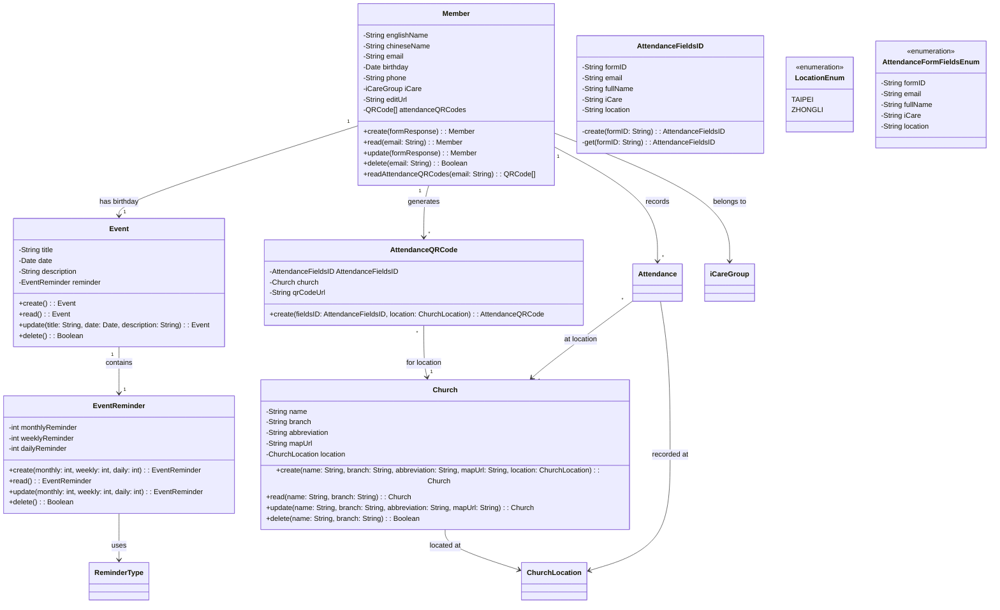

```mermaid
classDiagram
  class Member {
    -String englishName
    -String chineseName
    -String email
    -Date birthday
    -String phone
    -iCareGroup iCare
    -String editUrl
    -QRCode[] attendanceQRCodes

    +create(formResponse): Member
    +read(email: String): Member
    +update(formResponse): Member
    +delete(email: String): Boolean
    +readAttendanceQRCodes(email: String): QRCode[]
  }


  class AttendanceFieldsID {
    -String formID
    -String email
    -String fullName
    -String iCare
    -String location

    -create(formID: String): AttendanceFieldsID
    -get(formID: String): AttendanceFieldsID
  }

  class AttendanceQRCode {
    -AttendanceFieldsID AttendanceFieldsID
    -Church church
    -String qrCodeUrl

    +create(fieldsID: AttendanceFieldsID, location: ChurchLocation): AttendanceQRCode
  }

  class EventReminder {
    -int monthlyReminder
    -int weeklyReminder
    -int dailyReminder

    +create(monthly: int, weekly: int, daily: int): EventReminder
    +read(): EventReminder
    +update(monthly: int, weekly: int, daily: int): EventReminder
    +delete(): Boolean
  }

  class Church {
    -String name
    -String branch
    -String abbreviation
    -String mapUrl
    -ChurchLocation location

    +create(name: String, branch: String, abbreviation: String, mapUrl: String, location: ChurchLocation): Church
    +read(name: String, branch: String): Church
    +update(name: String, branch: String, abbreviation: String, mapUrl: String): Church
    +delete(name: String, branch: String): Boolean
  }

  class Event {
    -String title
    -Date date
    -String description
    -EventReminder reminder

    +create(): Event
    +read(): Event
    +update(title: String, date: Date, description: String): Event
    +delete(): Boolean
  }

  class LocationEnum {
    <<enumeration>>
    TAIPEI
    ZHONGLI
  }

  class AttendanceFormFieldsEnum{
    <<enumeration>>
    -String formID
    -String email
    -String fullName
    -String iCare
    -String location
  }

  Member "1" --> "1" Event : has birthday
  Member "1" --> "*" AttendanceQRCode : generates
  Member "1" --> "*" Attendance : records
  Event "1" --> "1" EventReminder : contains
  AttendanceQRCode "*" --> "1" Church : for location
  Attendance "*" --> "1" Church : at location
  
  Member --> iCareGroup : belongs to
  Church --> ChurchLocation : located at
  Attendance --> ChurchLocation : recorded at
  EventReminder --> ReminderType : uses
```
