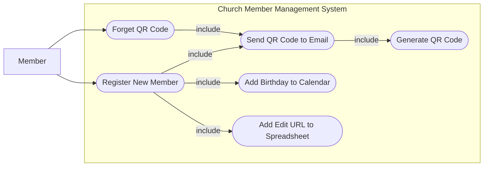
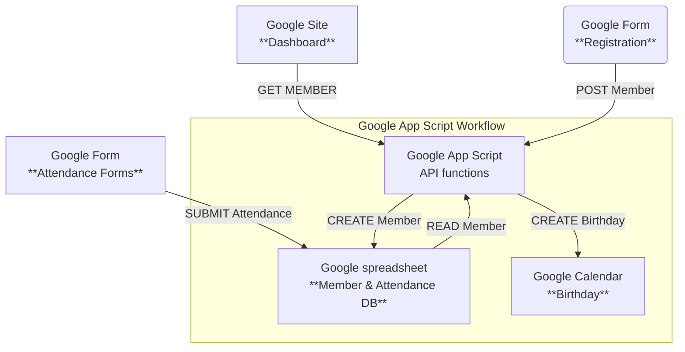
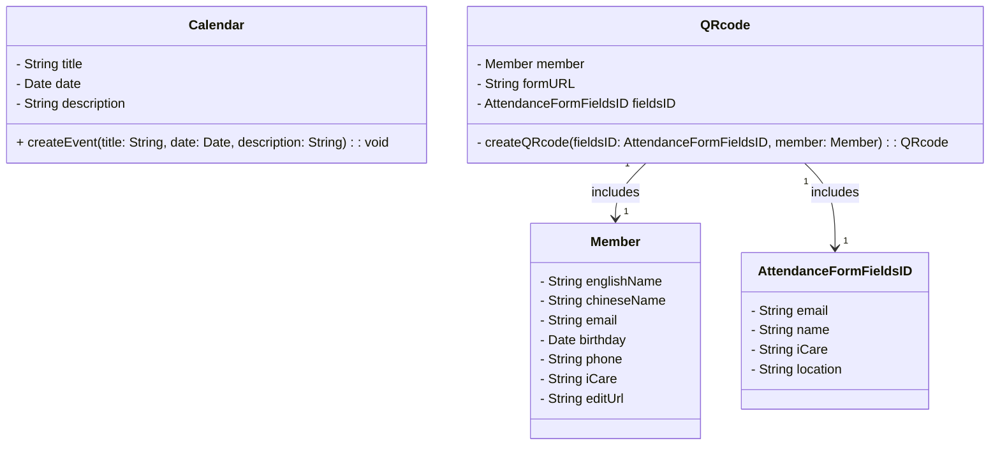
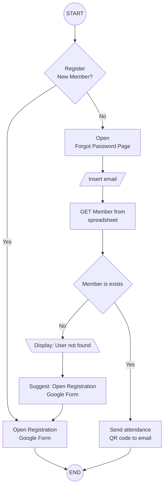
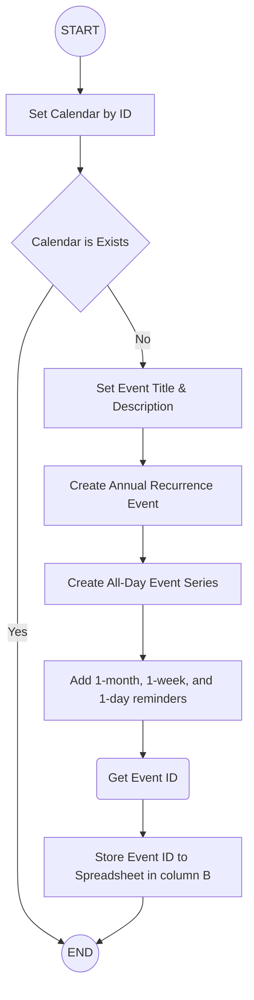
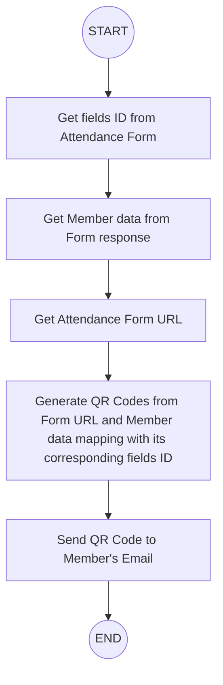

# Church Member Management System Tutorial

A comprehensive tutorial and implementation guide for building an automated church member management system using Google Forms, Google Sheets, and Google Apps Script.

## Table of Contents

- [Church Member Management System Tutorial](#church-member-management-system-tutorial)
  - [Table of Contents](#table-of-contents)
  - [Overview](#overview)
  - [Use Case Diagram](#use-case-diagram)
  - [System Architecture](#system-architecture)
  - [Class Diagram](#class-diagram)
  - [Features](#features)
    - [1. Web Dashboard](#1-web-dashboard)
    - [2. Add Calendar](#2-add-calendar)
    - [3. Generate QR Code](#3-generate-qr-code)
    - [4. Send QR Code to Email](#4-send-qr-code-to-email)

## Overview

This project demonstrates how to build a complete church member management system that:

- **Collects member data** through Google Forms
- **Processes and validates** submissions automatically
- **Manages birthdays** in Google Calendar
- **Generates QR codes** for attendance tracking
- **Sends welcome emails** with personalized content
- **Prevents duplicate** registrations

## Use Case Diagram

## System Architecture

## Class Diagram

## Features

### 1. Web Dashboard

### 2. Add Calendar

### 3. Generate QR Code

### 4. Send QR Code to Email

TBC.
