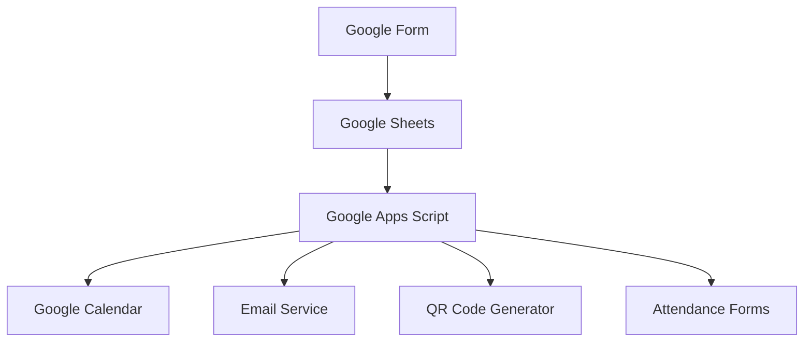
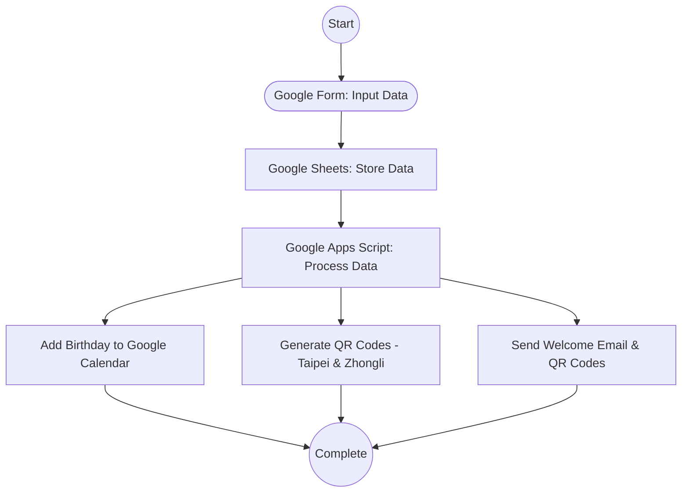
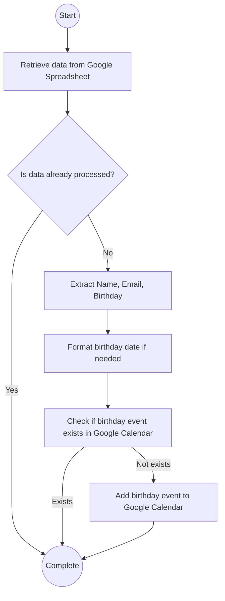

# Church Member Management System Tutorial

[](https://www.gnu.org/licenses/gpl-3.0)
[](https://script.google.com/)
[](https://github.com/yourusername/church-member-management)

A comprehensive tutorial and implementation guide for building an automated church member management system using Google Forms, Google Sheets, and Google Apps Script.

## 📚 Table of Contents

- [Overview](#overview)
- [Features](#-features)
- [Recent Updates (July 2025)](#-recent-updates-july-2025)
- [Prerequisites](#-prerequisites)
- [Quick Start](#-quick-start)
- [Tutorial](#-tutorial)
- [API Documentation](#-api-documentation)
- [Configuration](#️-configuration)
- [Deployment](#-deployment)
- [Troubleshooting](#-troubleshooting)
- [Contributing](#-contributing)
- [License](#-license)

## Overview

This project demonstrates how to build a complete church member management system that:

- **Collects member data** through Google Forms
- **Processes and validates** submissions automatically
- **Manages birthdays** in Google Calendar
- **Generates QR codes** for attendance tracking
- **Sends welcome emails** with personalized content
- **Prevents duplicate** registrations

### System Architecture



## ✨ Features

### Core Features

- ✅ **Dynamic Form Processing** - Handles form structure changes automatically
- ✅ **Smart Duplicate Detection** - Prevents duplicate member registrations
- ✅ **Birthday Calendar Integration** - Automatic birthday event creation
- ✅ **QR Code Generation** - Personalized attendance QR codes
- ✅ **Email Automation** - Welcome emails with attachments
- ✅ **Error Handling** - Comprehensive error logging and recovery

### Advanced Features

- ✅ **Field Mapping** - Dynamic field detection and mapping
- ✅ **Multi-location Support** - Support for multiple church locations
- ✅ **Edit Response Tracking** - Easy member information updates
- ✅ **Admin Notifications** - Critical error notifications to administrators
- ✅ **Development Tools** - Local development with clasp integration

## 🔄 Recent Updates (July 2025)

### ⚡ Calendar Module Refactoring

- **🗂️ Modular Architecture**: Separated birthday logic into dedicated `development/calendar.js` module
- **🔗 Combined Functions**: Merged `formatBirthdayEventTitle` and `formatBirthdayEventDescription` into single `formatBirthdayEvent()` function
- **🧹 Code Cleanup**: Removed unnecessary utility functions, reduced calendar.js from 487 to 148 lines (69% reduction)
- **📊 Spreadsheet-First**: Duplicate checking now handled via spreadsheet rather than calendar events
- **⚡ Performance**: Streamlined birthday creation workflow with better error handling

### 🛠️ Technical Improvements

- **📚 Enhanced Documentation**: Updated API documentation with current function signatures
- **🔧 Better Configuration**: Cleaner config structure with field-based mapping
- **🧪 Focused Testing**: Simplified test functions for essential features only
- **📁 File Organization**: Clear separation between production and development versions

## 📋 Prerequisites

Before starting this tutorial, you should have:

### Required Knowledge

- Basic JavaScript understanding
- Familiarity with Google Workspace (Forms, Sheets, Drive)
- Basic understanding of APIs and web services

### Required Tools

- Google account with Google Workspace access
- Code editor (VS Code recommended)
- Node.js (for local development)
- Git (for version control)

### Optional but Recommended

- Basic understanding of:
  - **Variables**: Data containers (`const name = "John"`)
  - **Functions**: Reusable code blocks
  - **Arrays**: Data collections (`[item1, item2, item3]`)
  - **Objects**: Key-value pairs (`{name: "John", age: 30}`)
  - **Conditionals**: Decision making (`if/else`)
  - **Loops**: Repetitive tasks (`for`, `while`)

---

## 🚀 Quick Start

### 1. Clone and Setup

```bash
git clone https://github.com/yourusername/church-member-management.git
cd church-member-management
npm install -g @google/clasp
clasp login
```

### 2. Configure Your Project

1. Copy your Google Apps Script project ID
2. Update `config.js` with your form and calendar IDs
3. Deploy using `clasp push`

### 3. Test the System

Run the test functions to verify everything works:

```javascript
// In Google Apps Script editor
logQuestionIDs();        // Verify form field mapping
testDuplicateDetection(); // Test duplicate prevention
sendTestEmail();         // Test email functionality
```

---

## 📖 Tutorial

This comprehensive tutorial will guide you through building a complete church member management system from scratch.

### Chapter 1: Understanding the System

#### 1.1 What We're Building

Our church member management system automates several key processes:

1. **Data Collection**: Members fill out a Google Form with their information
2. **Data Processing**: Google Apps Script processes the form submissions
3. **Birthday Management**: Automatically adds birthdays to Google Calendar
4. **QR Code Generation**: Creates personalized QR codes for attendance
5. **Email Communication**: Sends welcome emails with QR codes attached

#### 1.2 System Workflow



#### 1.3 Detailed Processing Flow



### Chapter 2: Step-by-Step Implementation

#### Step 1: Create Google Form

1. **Go to Google Forms**: Visit [forms.google.com](https://forms.google.com)
2. **Create a new form** with the following fields:
   - **Full Name** (Short answer, Required)
   - **Email** (Email, Required)
   - **Birthday** (Date, Required)
   - **Phone Number** (Short answer, Optional)
   - **iCare Group** (Multiple choice, Optional)

3. **Configure form settings**:
   - Enable "Collect email addresses"
   - Enable "Response receipts"
   - Set up response destination to Google Sheets

#### Step 2: Connect to Google Sheets

1. **Link form to spreadsheet**: Click on "Responses" tab → Click spreadsheet icon
2. **Create new spreadsheet** or select existing one
3. **Verify column structure**: Ensure columns match your form fields

#### Step 3: Set Up Google Apps Script

1. **Open Google Apps Script**: Visit [script.google.com](https://script.google.com)
2. **Create new project**: Click "New Project"
3. **Rename project**: Give it a meaningful name like "Church Member Management"

```excel
=IF(A2<>"", IMAGE("https://api.qrserver.com/v1/create-qr-code/?size=150x150&data=" & ENCODEURL("https://docs.google.com/forms/d/e/1FAIpQLSfeztXprLdisVVjuv3aJra16_MWE2W4IRRAFdu6ygmfRGgoJA/viewform?usp=pp_url&entry.912489277=" & TEXT($A2, "m/d/yyyy h:mm:ss") & "&entry.2091296168=" & IF(B2<>"", INDEX(SPLIT(B2, " "), 1), "") & "&entry.1008173553=Taipei")), "")
```

- Ganti URL form dan ID `entry` sesuai milik Anda.

- Buat salinan untuk kolom QR Zhongli, ganti `Taipei` menjadi `Zhongli`.

#### Langkah 4: Tambahkan Ulang Tahun ke Google Calendar (Apps Script)

```javascript
function addToCalendar() {
  const sheet = SpreadsheetApp.getActiveSpreadsheet().getSheetByName("Form Responses 1");
  const calendar = CalendarApp.getCalendarById("your_calendar_id@group.calendar.google.com");

  const data = sheet.getDataRange().getValues();
  for (let i = 1; i < data.length; i++) {
    const name = data[i][1];
    const birthday = new Date(data[i][2]);
    calendar.createAllDayEvent(`${name}'s Birthday`, birthday);
  }
}
```

#### Langkah 5: Kirim Email Selamat Datang dengan QR Code

```javascript
function sendWelcomeEmails() {
  const sheet = SpreadsheetApp.getActiveSpreadsheet().getSheetByName("Form Responses 1");
  const data = sheet.getDataRange().getValues();
  
  for (let i = 1; i < data.length; i++) {
    const email = data[i][3];
    const name = data[i][1];
    const qrUrlTaipei = "URL QR Taipei Anda";
    const qrUrlZhongli = "URL QR Zhongli Anda";

    const subject = `Selamat Datang di Gereja, ${name}!`;
    const body = `Dear ${name},

Selamat datang di komunitas gereja!

Berikut QR Code kehadiran Anda:
Taipei: ${qrUrlTaipei}
Zhongli: ${qrUrlZhongli}

Tuhan memberkati,
Admin Gereja`;

    MailApp.sendEmail(email, subject, body);
  }
}
```

> 💡 _Anda bisa mengatur trigger otomatis saat form disubmit._

---

### 2.3 Configuration & Setup

#### 2.3.1 Local Development with Clasp

To enable local development and syncing with Google Apps Script:

1. **Install clasp globally:**

   ```bash
   npm install -g @google/clasp
   ```

2. **Login to your Google account:**

   ```bash
   clasp login
   ```

3. **Clone your existing Apps Script project:**

   ```bash
   clasp clone [SCRIPT_ID]
   ```

   (Find SCRIPT_ID in your Apps Script project URL)

4. **Development workflow:**

   ```bash
   # Pull latest changes from cloud
   clasp pull
   
   # Make your local changes
   # ...
   
   # Push changes to cloud
   clasp push
   
   # Open script in browser
   clasp open
   ```

#### 2.3.2 Project Structure

```
/church-member-management
├── appsscript.json              # Apps Script configuration
├── .clasp.json                  # Clasp configuration for local development
├── Code.js                      # Legacy main script (if any)
├── config.js                    # Configuration file
├── main.js                      # Main script logic
├── utilities.js                 # Utility functions
├── test.js                      # Test functions
└── development/
    ├── calendar.js              # Birthday calendar management module
    ├── main.js                  # Development version of main script
    ├── config.js                # Development configuration
    └── test.js                  # Development test functions
```

**Key Files:**

- 📁 **`main.js`** - Main workflow logic and form processing
- 📁 **`development/calendar.js`** - Clean, focused birthday calendar integration
- 📁 **`config.js`** - Central configuration with field mapping
- 📁 **`utilities.js`** - Helper functions and utilities
- 📁 **`test.js`** - Comprehensive testing functions

#### 2.3.3 Configuration Setup

The `config.js` file uses **field titles** instead of hardcoded IDs for better maintainability:

```javascript
const CONFIG = {
  // Form & Calendar IDs
  REGISTRATION_FORM_ID: 'your-form-id',
  BIRTHDAY_CALENDAR_ID: 'your-calendar-id',
  
  // Spreadsheet Configuration
  SPREADSHEET: {
    ID: 'your-spreadsheet-id',
    SHEET: 'Sheet1' // or your sheet name
  },
  
  // Form Field Titles (Match your form exactly)
  FIELD_TITLES: {
    ENGLISH_NAME: 'Full Name',        // Your form's name field title
    CHINESE_NAME: 'Chinese Name',     // Your form's Chinese name field title
    BIRTHDAY: 'Tanggal Lahir',        // Your form's birthday field title
    ICARE: 'iCare',                   // Your form's iCare field title
    EMAIL: 'Email',                   // Your form's email field title (if separate)
    PHONE: 'WhatsApp Number'          // Your form's phone field title
  },
  
  // Attendance Form Field Titles (For auto-detecting entry IDs)
  ATTENDANCE_FORM_FIELDS: {
    EMAIL: 'Email Jemaat Terdaftar',  // Attendance form email field title
    PHONE: 'WhatsApp Number',         // Attendance form phone field title
    FULL_NAME: 'Full Name',           // Attendance form name field title
    ICARE: 'iCare',                   // Attendance form iCare field title
    LOCATION: 'Lokasi'                // Attendance form location field title
  },
  
  // Manual Entry ID Overrides (Optional - leave empty for auto-detection)
  ENTRY_ID_EMAIL: '',               // Override auto-detection if needed
  ENTRY_ID_PHONE: '',               // Override auto-detection if needed
  ENTRY_ID_FULL_NAME: '',           // Override auto-detection if needed
  ENTRY_ID_ICARE: '',               // Override auto-detection if needed
  ENTRY_ID_LOCATION: ''             // Override auto-detection if needed
};
```

#### 2.3.4 Dynamic Field Mapping

The system now uses **dynamic field mapping** instead of hardcoded column indices:

**Benefits:**

- ✅ Works regardless of form field order
- ✅ Automatically handles form structure changes
- ✅ No need to manually update column indices

**How it works:**

1. **Email Field**:
   - If `QID_EMAIL` is 0 (default): Uses auto-collected respondent email (column 1)
   - If `QID_EMAIL` is set: Uses that specific form field
2. **Phone Field**: Uses `getColumnIndexForFieldId(CONFIG.QID_PHONE)` to find the correct column
3. **Other Fields**: All mapped dynamically using their Question IDs

**Finding and Verifying Fields:**

```javascript
// Run this function to see all registration form fields and verify configuration
function logQuestionIDs() {
  // Shows all fields with ✅ CONFIGURED or ❌ NOT FOUND status
}

// Run this function to see all attendance form fields and verify field matching
function logAttendanceFormFields() {
  // Shows all attendance form fields and which ones match your configuration
}

// Run this function to test entry ID auto-detection
function testEntryIdDetection() {
  // Shows auto-detected entry IDs and generates sample pre-filled URLs
}

// Run this function to check which fields are required
function logFieldRequirements() {
  // Shows requirement status - only required fields are checked for duplicates
}
```

#### 2.3.5 New Features

**1. Edit Response URL Tracking**

- Automatically adds edit response URL to spreadsheet (column A)
- Allows easy editing of member information later

**2. Duplicate Prevention**

- Checks for existing members by email or phone number
- **Smart Field Checking**: Only enforces uniqueness for fields marked as "required" in the form
- Prevents duplicate birthday events in calendar
- Uses dynamic field mapping for reliable detection
- Supports both auto-collected email and custom email fields

**3. Error Handling**

- Graceful handling of missing fields or configuration errors
- Detailed logging for troubleshooting
- Admin email notifications for critical errors

---

### 2.4 Implementasi Kode

#### Step 4: Configure the System

Create the main configuration file and core functions:

```javascript
/**
 * Configuration file for Church Member Management System
 * @fileoverview Contains all configuration settings and constants
 */
const CONFIG = {
  // Form & Calendar IDs - Replace with your actual IDs
  REGISTRATION_FORM_ID: 'your-form-id-here',
  ATTENDANCE_FORM_ID: 'your-attendance-form-id-here', 
  BIRTHDAY_CALENDAR_ID: 'your-calendar-id@group.calendar.google.com',
  
  // Spreadsheet Configuration
  SPREADSHEET: {
    ID: 'your-spreadsheet-id-here',
    SHEET: 'Form Responses 1'
  },
  
  // Form Field Titles (Match your form exactly)
  FIELD_TITLES: {
    ENGLISH_NAME: 'Full Name',
    CHINESE_NAME: 'Chinese Name',
    BIRTHDAY: 'Birthday',
    ICARE: 'iCare Group',
    EMAIL: 'Email',
    PHONE: 'Phone Number'
  }
};
```

#### Step 5: Implement Core Functions

Copy and paste the main processing functions (detailed in API Documentation section below).

#### Step 6: Set Up Automation

1. **Create triggers**: Go to Script Editor → Triggers → Add Trigger
2. **Configure on form submit**: Select your main function to run on form submission
3. **Test the system**: Submit a test form entry to verify everything works

---

## 📊 API Documentation

### Core Functions

#### `onFormSubmit(e)`

**Description**: Main entry point triggered when a form is submitted. Processes new member registration and handles all automated tasks.

**Parameters**:

- `e` (Object): Form submission event object containing form data

**Returns**: void

**Throws**:

- `Error`: When form data is invalid or processing fails

**Example**:

```javascript
// Automatically called by Google Apps Script trigger
function onFormSubmit(e) {
  try {
    const formData = extractFormData(e);
    if (isDuplicate(formData)) {
      console.log('Duplicate entry detected, skipping...');
      return;
    }
    
    processNewMember(formData);
  } catch (error) {
    console.error('Error in onFormSubmit:', error);
    notifyAdmin(error);
  }
}
```

**Related Functions**: `extractFormData()`, `isDuplicate()`, `processNewMember()`

---

#### `extractFormData(e)`

**Description**: Extracts and validates form submission data from the event object.

**Parameters**:

- `e` (Object): Form submission event object

**Returns**:

- `Object`: Formatted member data object

**Return Format**:

```javascript
{
  timestamp: Date,
  fullName: string,
  email: string,
  birthday: Date,
  phone: string,
  iCareGroup: string,
  editUrl: string
}
```

**Example**:

```javascript
function extractFormData(e) {
  const responses = e.response.getItemResponses();
  const memberData = {
    timestamp: new Date(),
    editUrl: e.response.getEditResponseUrl()
  };
  
  // Extract each field based on question title
  responses.forEach(response => {
    const title = response.getItem().getTitle();
    const value = response.getResponse();
    
    switch(title) {
      case CONFIG.FIELD_TITLES.ENGLISH_NAME:
        memberData.fullName = value;
        break;
      case CONFIG.FIELD_TITLES.EMAIL:
        memberData.email = value;
        break;
      // ... other fields
    }
  });
  
  return memberData;
}
```

---

#### `addBirthdayToCalendar(member)` - Calendar Module

**Description**: Creates a recurring annual birthday event on Google Calendar. This function is part of the dedicated `calendar.js` module for clean separation of concerns.

**Module**: `development/calendar.js`

**Parameters**:

- `member` (Object): Member information object
  - `member.englishName` (string): Member's English name
  - `member.chineseName` (string): Member's Chinese name (optional)
  - `member.birthday` (Date): Member's birthday date
  - `member.email` (string): Member's email (optional)
  - `member.iCare` (string): Member's iCare group (optional)

**Returns**:

- `GoogleAppsScript.Calendar.CalendarEventSeries`: The created recurring birthday event

**Throws**:

- `Error`: When calendar access fails, invalid data provided, or event creation fails

**Features**:

- ✅ **Input Validation**: Validates member data and birthday date
- ✅ **Calendar Access**: Connects to configured birthday calendar
- ✅ **Recurring Events**: Creates annual recurring events for 99 years
- ✅ **Smart Formatting**: Uses combined title and description generation
- ✅ **Reminders**: Adds 1-week and 1-day reminders automatically
- ✅ **Error Handling**: Graceful error handling with detailed logging

**Example**:

```javascript
// Member data object
const member = {
  englishName: 'John Doe',
  chineseName: '約翰',
  birthday: new Date('1990-01-15'),
  email: 'john@example.com',
  iCare: 'Adult Group'
};

try {
  // Create birthday event (called from main.js workflow)
  const eventSeries = addBirthdayToCalendar(member);
  Logger.log(`✅ Birthday event created for ${member.englishName}`);
} catch (error) {
  Logger.log(`❌ Failed to create birthday event: ${error.message}`);
}
```

**Implementation Notes**:

- Uses `formatBirthdayEvent()` helper function for consistent formatting
- Duplicate checking is handled at the spreadsheet level by `checkIfMemberExists()`
- Calendar ID is configured in `CONFIG.BIRTHDAY_CALENDAR_ID`
- Event location is set to "Church Community"

---

#### `formatBirthdayEvent(member)` - Calendar Module

**Description**: Formats both title and description for birthday events. This function combines the previously separate title and description formatting into a single, efficient function.

**Module**: `development/calendar.js`

**Parameters**:

- `member` (Object): Member information object (same as above)

**Returns**:

- `Object`: Object containing formatted title and description
  - `title` (string): Formatted event title with emoji and names
  - `description` (string): Detailed event description with member info

**Example**:

```javascript
const member = {
  englishName: 'John Doe',
  chineseName: '約翰',
  birthday: new Date('1990-01-15'),
  email: 'john@example.com',
  iCare: 'Adult Group'
};

const { title, description } = formatBirthdayEvent(member);

// title: "🎂 John Doe (約翰)'s Birthday"
// description: "🎉 Happy Birthday John Doe!\n\n📝 Member Details:\n• English Name: John Doe\n• Chinese Name: 約翰\n..."
```

**Output Format**:

- **Title**: `🎂 [English Name] ([Chinese Name])'s Birthday`
- **Description**: Includes member details, birth year, email, and iCare group
    throw error;
  }
}

```

---

#### `generateQRCodes(memberData)`

**Description**: Generates QR codes for member attendance at different locations.

**Parameters**:
- `memberData` (Object): Member information for QR code generation

**Returns**:
- `Object`: Object containing QR code URLs for different locations

**Return Format**:
```javascript
{
  taipei: string,   // QR code URL for Taipei location
  zhongli: string   // QR code URL for Zhongli location
}
```

**Example**:

```javascript
/**
 * Generates QR codes for member attendance tracking
 * @param {Object} memberData - Member information
 * @returns {Object} QR code URLs for different locations
 */
function generateQRCodes(memberData) {
  const baseUrl = `https://docs.google.com/forms/d/e/${CONFIG.ATTENDANCE_FORM_ID}/viewform`;
  const qrBaseUrl = 'https://api.qrserver.com/v1/create-qr-code/';
  
  // Generate pre-filled URLs for each location
  const locations = ['Taipei', 'Zhongli'];
  const qrCodes = {};
  
  locations.forEach(location => {
    // Create pre-filled form URL
    const prefilledUrl = `${baseUrl}?usp=pp_url` +
      `&entry.${getEntryId('email')}=${encodeURIComponent(memberData.email)}` +
      `&entry.${getEntryId('name')}=${encodeURIComponent(memberData.fullName)}` +
      `&entry.${getEntryId('location')}=${encodeURIComponent(location)}`;
    
    // Generate QR code URL
    const qrUrl = `${qrBaseUrl}?size=200x200&data=${encodeURIComponent(prefilledUrl)}`;
    
    qrCodes[location.toLowerCase()] = qrUrl;
  });
  
  return qrCodes;
}
```

---

#### `sendWelcomeEmail(memberData, qrCodes)`

**Description**: Sends a personalized welcome email to new members with QR codes attached.

**Parameters**:

- `memberData` (Object): Member information
- `qrCodes` (Object): QR code URLs for different locations

**Returns**: void

**Throws**:

- `Error`: When email sending fails

**Example**:

```javascript
/**
 * Sends welcome email with QR codes to new member
 * @param {Object} memberData - Member information
 * @param {Object} qrCodes - QR code URLs
 */
function sendWelcomeEmail(memberData, qrCodes) {
  try {
    const subject = `Welcome to Our Church Community! 🙏`;
    
    const htmlBody = `
      <div style="font-family: Arial, sans-serif; max-width: 600px; margin: 0 auto;">
        <h2 style="color: #2E7D32;">Welcome ${memberData.fullName}!</h2>
        
        <p>We're delighted to have you join our church community. Below are your personal QR codes for attendance tracking:</p>
        
        <div style="display: flex; justify-content: space-around; margin: 20px 0;">
          <div style="text-align: center;">
            <h3>Taipei Location</h3>
            
          </div>
          <div style="text-align: center;">
            <h3>Zhongli Location</h3>
            
          </div>
        </div>
        
        <p><strong>How to use:</strong> Simply show your QR code at check-in, or scan it yourself using the attendance tablets.</p>
        
        <hr style="margin: 30px 0;">
        <p style="color: #666; font-size: 14px;">
          If you need to update your information, you can use this link: 
          <a href="${memberData.editUrl}">Edit Your Response</a>
        </p>
        
        <p>God bless,<br>Church Admin Team</p>
      </div>
    `;
    
    // Send email
    GmailApp.sendEmail(
      memberData.email,
      subject,
      '', // Plain text body (empty, using HTML)
      {
        htmlBody: htmlBody,
        name: 'Church Admin Team'
      }
    );
    
    console.log(`Welcome email sent to ${memberData.email}`);
    
  } catch (error) {
    console.error(`Failed to send welcome email to ${memberData.email}:`, error);
    throw error;
  }
}
```

---

#### `isDuplicate(memberData)`

**Description**: Checks if a member is already registered based on email or phone number.

**Parameters**:

- `memberData` (Object): Member information to check

**Returns**:

- `boolean`: True if duplicate found, false otherwise

**Example**:

```javascript
/**
 * Checks for duplicate member registration
 * @param {Object} memberData - Member data to check
 * @returns {boolean} True if duplicate exists
 */
function isDuplicate(memberData) {
  try {
    const sheet = SpreadsheetApp.openById(CONFIG.SPREADSHEET.ID)
      .getSheetByName(CONFIG.SPREADSHEET.SHEET);
    
    const data = sheet.getDataRange().getValues();
    const headers = data[0];
    
    // Find email and phone columns
    const emailCol = headers.indexOf('Email') + 1;
    const phoneCol = headers.indexOf('Phone Number') + 1;
    
    // Check each row for duplicates
    for (let i = 1; i < data.length; i++) {
      const rowEmail = data[i][emailCol - 1];
      const rowPhone = data[i][phoneCol - 1];
      
      // Check for email match
      if (rowEmail && memberData.email && 
          rowEmail.toLowerCase() === memberData.email.toLowerCase()) {
        console.log(`Duplicate email found: ${memberData.email}`);
        return true;
      }
      
      // Check for phone match
      if (rowPhone && memberData.phone && 
          cleanPhoneNumber(rowPhone) === cleanPhoneNumber(memberData.phone)) {
        console.log(`Duplicate phone found: ${memberData.phone}`);
        return true;
      }
    }
    
    return false;
    
  } catch (error) {
    console.error('Error checking for duplicates:', error);
    return false; // Allow processing if check fails
  }
}
```

### Utility Functions

#### `cleanPhoneNumber(phone)`

**Description**: Standardizes phone number format for comparison.

**Parameters**:

- `phone` (string): Raw phone number

**Returns**:

- `string`: Cleaned phone number with only digits

#### `getEntryId(fieldName)`

**Description**: Gets the entry ID for a form field to create pre-filled URLs.

**Parameters**:

- `fieldName` (string): Name of the form field

**Returns**:

- `string`: Entry ID for the field

#### `notifyAdmin(error)`

**Description**: Sends error notifications to administrators.

**Parameters**:

- `error` (Error): Error object to report

**Returns**: void

---

## ⚙️ Configuration

### Environment Setup

#### 1. Local Development Setup

**Install clasp (Google Apps Script CLI)**:

```bash
npm install -g @google/clasp
```

**Login to Google Apps Script**:

```bash
clasp login
```

**Clone your project** (replace with your Script ID):

```bash
clasp clone YOUR_SCRIPT_ID_HERE
```

#### 2. Project Configuration

**Create `.clasp.json`** (if not exists):

```json
{
  "scriptId": "YOUR_SCRIPT_ID_HERE",
  "rootDir": "."
}
```

**Update `appsscript.json`**:

```json
{
  "timeZone": "Asia/Taipei",
  "dependencies": {
    "enabledAdvancedServices": [
      {
        "userSymbol": "Calendar",
        "serviceId": "calendar",
        "version": "v3"
      },
      {
        "userSymbol": "Gmail",
        "serviceId": "gmail",
        "version": "v1"
      }
    ]
  },
  "webapp": {
    "access": "MYSELF",
    "executeAs": "USER_DEPLOYING"
  },
  "exceptionLogging": "STACKDRIVER"
}
```

### Configuration Variables

#### Required IDs to Configure

| Variable | Description | How to Find |
|----------|-------------|-------------|
| `REGISTRATION_FORM_ID` | Google Form ID for member registration | Form URL: `forms.google.com/d/{FORM_ID}/edit` |
| `ATTENDANCE_FORM_ID` | Google Form ID for attendance tracking | Form URL: `forms.google.com/d/{FORM_ID}/edit` |
| `BIRTHDAY_CALENDAR_ID` | Google Calendar ID for birthdays | Calendar Settings → Calendar ID |
| `SPREADSHEET.ID` | Google Sheets ID for form responses | Sheet URL: `docs.google.com/spreadsheets/d/{SHEET_ID}` |

#### Field Title Mapping

**Important**: Field titles must match exactly with your Google Form field titles.

```javascript
const CONFIG = {
  FIELD_TITLES: {
    ENGLISH_NAME: 'Full Name',        // ← Must match your form field title
    CHINESE_NAME: 'Chinese Name',     // ← Must match your form field title  
    BIRTHDAY: 'Birthday',             // ← Must match your form field title
    ICARE: 'iCare Group',             // ← Must match your form field title
    EMAIL: 'Email',                   // ← Must match your form field title
    PHONE: 'Phone Number'             // ← Must match your form field title
  }
};
```

### Testing Configuration

**Run these functions to verify your setup**:

```javascript
// 1. Test form field mapping
function testConfiguration() {
  logQuestionIDs();              // Shows all form fields and their status
  logFieldRequirements();        // Shows which fields are required
  testEntryIdDetection();        // Tests QR code URL generation
}

// 2. Test email functionality  
function testEmailSystem() {
  const testData = {
    fullName: 'Test User',
    email: 'your-email@example.com',
    birthday: new Date('1990-01-01'),
    editUrl: 'https://example.com'
  };
  
  const qrCodes = generateQRCodes(testData);
  sendWelcomeEmail(testData, qrCodes);
}

// 3. Test calendar integration
function testCalendarIntegration() {
  const testData = {
    fullName: 'Test User',
    birthday: new Date('1990-01-01')
  };
  
  addBirthdayToCalendar(testData);
}
```

---

## 🚀 Deployment

### Step 1: Prepare for Deployment

**1. Update configuration**:

- Replace all placeholder IDs with your actual Google service IDs
- Verify field titles match your form exactly
- Test all functions locally

**2. Push code to Google Apps Script**:

```bash
# Push all changes to cloud
clasp push

# Open script editor in browser
clasp open
```

### Step 2: Set Up Permissions

**1. Run initial setup**:

- Go to Google Apps Script editor
- Run any function to trigger permission prompts
- Grant all requested permissions:
  - Google Sheets access
  - Google Calendar access
  - Gmail sending permissions

**2. Test permissions**:

```javascript
// Run this to test all permissions
function testPermissions() {
  console.log('Testing Sheets access...');
  const sheet = SpreadsheetApp.openById(CONFIG.SPREADSHEET.ID);
  console.log('✅ Sheets access OK');
  
  console.log('Testing Calendar access...');
  const calendar = CalendarApp.getCalendarById(CONFIG.BIRTHDAY_CALENDAR_ID);
  console.log('✅ Calendar access OK');
  
  console.log('Testing Gmail access...');
  GmailApp.sendEmail(Session.getActiveUser().getEmail(), 'Test', 'Test message');
  console.log('✅ Gmail access OK');
}
```

### Step 3: Create Form Submission Trigger

**1. Go to Triggers**:

- In Apps Script editor: Left sidebar → Triggers ⏰
- Click "+ Add Trigger"

**2. Configure trigger**:

- Choose function: `onFormSubmit`
- Choose deployment: Head
- Select event source: From form
- Select form: (choose your registration form)
- Select event type: On form submit
- Notify on failure: Immediately

**3. Save and test**:

- Submit a test form entry
- Check execution transcript for any errors
- Verify email was sent and calendar event created

### Step 4: Set Up Error Monitoring

**1. Enable Stackdriver logging**:

- In `appsscript.json`, ensure `"exceptionLogging": "STACKDRIVER"`

**2. Create error notification function**:

```javascript
/**
 * Sends error notifications to administrators
 * @param {Error} error - Error object to report
 * @param {string} context - Context where error occurred
 */
function notifyAdmin(error, context = '') {
  const adminEmail = 'admin@yourchurch.com'; // Replace with admin email
  
  const subject = `🚨 Church Management System Error`;
  const body = `
    An error occurred in the Church Member Management System:
    
    Context: ${context}
    Error: ${error.message}
    Stack: ${error.stack}
    Time: ${new Date().toISOString()}
    
    Please check the Apps Script logs for more details.
  `;
  
  try {
    GmailApp.sendEmail(adminEmail, subject, body);
  } catch (emailError) {
    console.error('Failed to send admin notification:', emailError);
  }
}
```

### Step 5: Production Monitoring

**Monitor these aspects**:

1. **Form Submissions**: Check that all form entries trigger processing
2. **Email Delivery**: Verify welcome emails are being sent
3. **Calendar Events**: Confirm birthday events are created
4. **Error Logs**: Regularly check Apps Script execution logs
5. **Duplicate Detection**: Ensure duplicates are properly prevented

**Set up periodic health checks**:

```javascript
/**
 * Runs daily health check of the system
 * Schedule this to run daily via time-driven trigger
 */
function dailyHealthCheck() {
  try {
    // Check if services are accessible
    testPermissions();
    
    // Check recent form submissions
    const sheet = SpreadsheetApp.openById(CONFIG.SPREADSHEET.ID);
    const lastRow = sheet.getLastRow();
    
    console.log(`Health check passed. Total entries: ${lastRow - 1}`);
    
  } catch (error) {
    notifyAdmin(error, 'Daily Health Check');
  }
}
```

---

## 🐛 Troubleshooting

### Common Issues and Solutions

#### Issue 1: "Permission denied" errors

**Symptoms**: Script fails with permission errors

**Solutions**:

1. **Re-run authorization**: Delete triggers, run a function manually, re-grant permissions
2. **Check calendar permissions**: Ensure calendar is shared with script owner
3. **Verify spreadsheet access**: Check if spreadsheet exists and is accessible

#### Issue 2: Form fields not mapping correctly

**Symptoms**: Form data not extracted properly

**Solutions**:

1. **Run field mapping check**:

   ```javascript
   logQuestionIDs(); // Shows all form fields and their status
   ```

2. **Update field titles**: Ensure `CONFIG.FIELD_TITLES` exactly matches form field titles

3. **Check form structure**: Verify form hasn't been modified since configuration

#### Issue 3: QR codes not generating

**Symptoms**: QR code URLs are broken or empty

**Solutions**:

1. **Check attendance form ID**: Verify `CONFIG.ATTENDANCE_FORM_ID` is correct
2. **Test entry ID detection**:

   ```javascript
   testEntryIdDetection(); // Shows detected entry IDs
   ```

3. **Manual entry ID override**: Set entry IDs manually in config if auto-detection fails

#### Issue 4: Emails not sending

**Symptoms**: Welcome emails not received

**Solutions**:

1. **Check Gmail quota**: Google Apps Script has daily email limits
2. **Verify email addresses**: Ensure form collects valid email addresses  
3. **Test email function**:

   ```javascript
   sendTestEmail(); // Sends test email to verify setup
   ```

#### Issue 5: Duplicate detection not working

**Symptoms**: Duplicate members being processed

**Solutions**:

1. **Check required fields**: Only required form fields are checked for duplicates
2. **Verify phone number format**: Ensure consistent phone number formatting
3. **Test duplicate logic**:

   ```javascript
   testDuplicateDetection(); // Tests duplicate prevention logic
   ```

### Debug Mode

**Enable detailed logging**:

```javascript
// Add to top of any function for detailed logging
const DEBUG = true;

function debugLog(message, data = null) {
  if (DEBUG) {
    console.log(`[DEBUG] ${message}`, data || '');
  }
}
```

### Getting Help

**If you're still having issues**:

1. **Check execution logs**: Apps Script Editor → Executions
2. **Review error messages**: Look for specific error descriptions
3. **Test individual functions**: Run functions separately to isolate issues
4. **Contact support**: Include error logs and configuration details

---

## 🤝 Contributing

We welcome contributions to improve this church management system!

### How to Contribute

1. **Fork the repository**
2. **Create a feature branch**: `git checkout -b feature/amazing-feature`
3. **Make your changes**: Follow the coding standards below
4. **Test thoroughly**: Ensure all functions work correctly
5. **Submit a pull request**: Include description of changes

### Coding Standards

**JavaScript Style**:

- Use JSDoc comments for all functions
- Follow camelCase naming convention
- Include error handling in all functions
- Add comprehensive logging

**Documentation**:

- Update README.md for any new features
- Include code examples in function documentation
- Add troubleshooting entries for new issues

### Feature Requests

**Commonly requested features**:

- [ ] Integration with church database systems
- [ ] Advanced reporting and analytics
- [ ] Mobile app companion
- [ ] Multi-language support
- [ ] Advanced QR code customization
- [ ] Bulk import/export functionality

**To request features**:

1. Open an issue with "Feature Request" label
2. Describe the use case and expected behavior
3. Include mockups or examples if possible

---

## 📄 License

This project is licensed under the GNU General Public License v3.0 - see the [LICENSE](LICENSE) file for details.

This program is free software: you can redistribute it and/or modify it under the terms of the GNU General Public License as published by the Free Software Foundation, either version 3 of the License, or (at your option) any later version.

---

## 🙏 Acknowledgments

- Google Apps Script team for the excellent platform
- Church communities who provided feedback and testing
- Contributors who helped improve the system

---

**Built with ❤️ for church communities worldwide** 🌍
