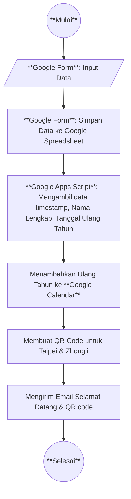

# Panduan Pemula: Dasar Pemrograman & Proyek Manajemen Anggota Gereja

## Bab 1: Dasar-dasar Pemrograman

### 1.1 Apa itu Pemrograman?

Pemrograman adalah proses memberikan instruksi kepada komputer untuk menjalankan tugas tertentu. Instruksi ini ditulis dalam bahasa yang dapat dimengerti oleh komputer, seperti Python, JavaScript, atau Java.

### 1.2 Konsep Dasar Pemrograman

- **Variabel**: Wadah untuk menyimpan nilai/data.

- **Tipe Data**: Tipe umum seperti string, angka, boolean, array.

- **Fungsi**: Blok kode untuk melakukan tugas tertentu.

- **Percabangan**: Logika seperti `if`, `else` untuk pengambilan keputusan.

- **Perulangan (Loop)**: Mengulangi tugas dengan `for` dan `while`.

- **API**: Antarmuka untuk berkomunikasi dengan layanan lain.

### 1.3 Mengapa Belajar Pemrograman?

Pemrograman membantu mengotomatiskan tugas, membuat aplikasi web, menganalisis data, dan menyelesaikan masalah secara efisien.

---

## Bab 2: Proyek – Manajemen Anggota Gereja

Proyek ini menunjukkan cara mengelola data anggota gereja menggunakan Google Form, Google Sheet, dan Google Apps Script.

### 2.1 Kebutuhan Proyek

Sistem ini akan:

1. Mengumpulkan data anggota gereja lewat **Google Form**.

2. Menggunakan **Google Apps Script** untuk:

   - Menambahkan ulang tahun anggota ke **Google Calendar**.

   - Membuat **dua kode QR** (Taipei & Zhongli).

   - Mengirim **email selamat datang** ke anggota beserta QR code.

---

### 2.2 Logika Latar Belakang

**Alur Berpikir:**



```mermaid
flowchart TD
    A((Mulai)) --> B[Ambil data dari Google Spreadsheet]
    B --> C{Apakah data sudah diproses?}
    C -- Sudah --> H((Selesai))
    C -- Belum --> D[Ambil Nama, Email, Tanggal Lahir]
    D --> E[Format tanggal lahir (tanpa tahun jika perlu)]
    E --> F[Periksa apakah event sudah ada di Google Calendar]
    F -- Sudah --> H
    F -- Belum --> G[Tambahkan event ulang tahun ke Google Calendar]
    G --> H((Selesai))
```

Diagram di atas menjelaskan langkah-langkah detail proses penambahan ulang tahun ke Google Calendar menggunakan Google Apps Script:

- Ambil data dari Google Spreadsheet.

- Cek apakah data sudah diproses (misal, dengan kolom status atau pengecekan event di kalender).

- Ambil nama, email, dan tanggal lahir.

- Format tanggal lahir sesuai kebutuhan (misal, hanya bulan dan tanggal).

- Cek apakah event ulang tahun sudah ada di Google Calendar.

- Jika belum, tambahkan event baru.

- Selesai.

- Google Form digunakan untuk mengumpulkan:

  - Nama (Bahasa Inggris)

  - Email

  - Tanggal Lahir

- Submisi direkam di Google Sheet.

- Google Apps Script membaca data dari Sheet dan:

  - Menambahkan ulang tahun ke kalender.

  - Membuat QR code berdasarkan waktu submisi dan nama.

  - Mengirim email personal ke anggota.

---

### 2.3 Langkah-langkah Implementasi

#### Langkah 1: Buat Google Form

- Form dengan kolom:

  - `Nama (Bahasa Inggris)`

  - `Email`

  - `Tanggal Lahir`

#### Langkah 2: Hubungkan ke Google Sheet

- Hubungkan form dengan Google Sheet agar semua respon tersimpan otomatis.

#### Langkah 3: Buat QR Code

Gunakan formula ini di Google Sheet untuk QR code:

```excel
=IF(A2<>"", IMAGE("https://api.qrserver.com/v1/create-qr-code/?size=150x150&data=" & ENCODEURL("https://docs.google.com/forms/d/e/1FAIpQLSfeztXprLdisVVjuv3aJra16_MWE2W4IRRAFdu6ygmfRGgoJA/viewform?usp=pp_url&entry.912489277=" & TEXT($A2, "m/d/yyyy h:mm:ss") & "&entry.2091296168=" & IF(B2<>"", INDEX(SPLIT(B2, " "), 1), "") & "&entry.1008173553=Taipei")), "")
```

- Ganti URL form dan ID `entry` sesuai milik Anda.

- Buat salinan untuk kolom QR Zhongli, ganti `Taipei` menjadi `Zhongli`.

#### Langkah 4: Tambahkan Ulang Tahun ke Google Calendar (Apps Script)

```javascript
function addToCalendar() {
  const sheet = SpreadsheetApp.getActiveSpreadsheet().getSheetByName("Form Responses 1");
  const calendar = CalendarApp.getCalendarById("your_calendar_id@group.calendar.google.com");

  const data = sheet.getDataRange().getValues();
  for (let i = 1; i < data.length; i++) {
    const name = data[i][1];
    const birthday = new Date(data[i][2]);
    calendar.createAllDayEvent(`${name}'s Birthday`, birthday);
  }
}
```

#### Langkah 5: Kirim Email Selamat Datang dengan QR Code

```javascript
function sendWelcomeEmails() {
  const sheet = SpreadsheetApp.getActiveSpreadsheet().getSheetByName("Form Responses 1");
  const data = sheet.getDataRange().getValues();
  
  for (let i = 1; i < data.length; i++) {
    const email = data[i][3];
    const name = data[i][1];
    const qrUrlTaipei = "URL QR Taipei Anda";
    const qrUrlZhongli = "URL QR Zhongli Anda";

    const subject = `Selamat Datang di Gereja, ${name}!`;
    const body = `Dear ${name},

Selamat datang di komunitas gereja!

Berikut QR Code kehadiran Anda:
Taipei: ${qrUrlTaipei}
Zhongli: ${qrUrlZhongli}

Tuhan memberkati,
Admin Gereja`;

    MailApp.sendEmail(email, subject, body);
  }
}
```

> 💡 _Anda bisa mengatur trigger otomatis saat form disubmit._

---

### 2.3 Configuration & Setup

#### 2.3.1 Local Development with Clasp

To enable local development and syncing with Google Apps Script:

1. **Install clasp globally:**
   ```bash
   npm install -g @google/clasp
   ```

2. **Login to your Google account:**
   ```bash
   clasp login
   ```

3. **Clone your existing Apps Script project:**
   ```bash
   clasp clone [SCRIPT_ID]
   ```
   (Find SCRIPT_ID in your Apps Script project URL)

4. **Development workflow:**
   ```bash
   # Pull latest changes from cloud
   clasp pull
   
   # Make your local changes
   # ...
   
   # Push changes to cloud
   clasp push
   
   # Open script in browser
   clasp open
   ```

#### 2.3.2 Project Structure

```
/church-member-management
├── appsscript.json          # Apps Script configuration
├── Code.js                  # Legacy main script (if any)
├── config.js                # Configuration file
├── main.js                  # Main script logic
├── utilities.js             # Utility functions
└── test.js                  # Test functions
```

#### 2.3.3 Configuration Setup

The `config.js` file uses **field titles** instead of hardcoded IDs for better maintainability:

```javascript
const CONFIG = {
  // Form & Calendar IDs
  REGISTRATION_FORM_ID: 'your-form-id',
  BIRTHDAY_CALENDAR_ID: 'your-calendar-id',
  
  // Spreadsheet Configuration
  SPREADSHEET: {
    ID: 'your-spreadsheet-id',
    SHEET: 'Sheet1' // or your sheet name
  },
  
  // Form Field Titles (Match your form exactly)
  FIELD_TITLES: {
    ENGLISH_NAME: 'Full Name',        // Your form's name field title
    CHINESE_NAME: 'Chinese Name',     // Your form's Chinese name field title
    BIRTHDAY: 'Tanggal Lahir',        // Your form's birthday field title
    ICARE: 'iCare',                   // Your form's iCare field title
    EMAIL: 'Email',                   // Your form's email field title (if separate)
    PHONE: 'WhatsApp Number'          // Your form's phone field title
  },
  
  // Attendance Form Field Titles (For auto-detecting entry IDs)
  ATTENDANCE_FORM_FIELDS: {
    EMAIL: 'Email Jemaat Terdaftar',  // Attendance form email field title
    PHONE: 'WhatsApp Number',         // Attendance form phone field title
    FULL_NAME: 'Full Name',           // Attendance form name field title
    ICARE: 'iCare',                   // Attendance form iCare field title
    LOCATION: 'Lokasi'                // Attendance form location field title
  },
  
  // Manual Entry ID Overrides (Optional - leave empty for auto-detection)
  ENTRY_ID_EMAIL: '',               // Override auto-detection if needed
  ENTRY_ID_PHONE: '',               // Override auto-detection if needed
  ENTRY_ID_FULL_NAME: '',           // Override auto-detection if needed
  ENTRY_ID_ICARE: '',               // Override auto-detection if needed
  ENTRY_ID_LOCATION: ''             // Override auto-detection if needed
};
```

#### 2.3.4 Dynamic Field Mapping

The system now uses **dynamic field mapping** instead of hardcoded column indices:

**Benefits:**
- ✅ Works regardless of form field order
- ✅ Automatically handles form structure changes
- ✅ No need to manually update column indices

**How it works:**
1. **Email Field**: 
   - If `QID_EMAIL` is 0 (default): Uses auto-collected respondent email (column 1)
   - If `QID_EMAIL` is set: Uses that specific form field
2. **Phone Field**: Uses `getColumnIndexForFieldId(CONFIG.QID_PHONE)` to find the correct column
3. **Other Fields**: All mapped dynamically using their Question IDs

**Finding and Verifying Fields:**
```javascript
// Run this function to see all registration form fields and verify configuration
function logQuestionIDs() {
  // Shows all fields with ✅ CONFIGURED or ❌ NOT FOUND status
}

// Run this function to see all attendance form fields and verify field matching
function logAttendanceFormFields() {
  // Shows all attendance form fields and which ones match your configuration
}

// Run this function to test entry ID auto-detection
function testEntryIdDetection() {
  // Shows auto-detected entry IDs and generates sample pre-filled URLs
}

// Run this function to check which fields are required
function logFieldRequirements() {
  // Shows requirement status - only required fields are checked for duplicates
}
```

#### 2.3.5 New Features

**1. Edit Response URL Tracking**
- Automatically adds edit response URL to spreadsheet (column A)
- Allows easy editing of member information later

**2. Duplicate Prevention**

- Checks for existing members by email or phone number
- **Smart Field Checking**: Only enforces uniqueness for fields marked as "required" in the form
- Prevents duplicate birthday events in calendar
- Uses dynamic field mapping for reliable detection
- Supports both auto-collected email and custom email fields

**3. Error Handling**
- Graceful handling of missing fields or configuration errors
- Detailed logging for troubleshooting
- Admin email notifications for critical errors

---

### 2.4 Implementasi Kode
